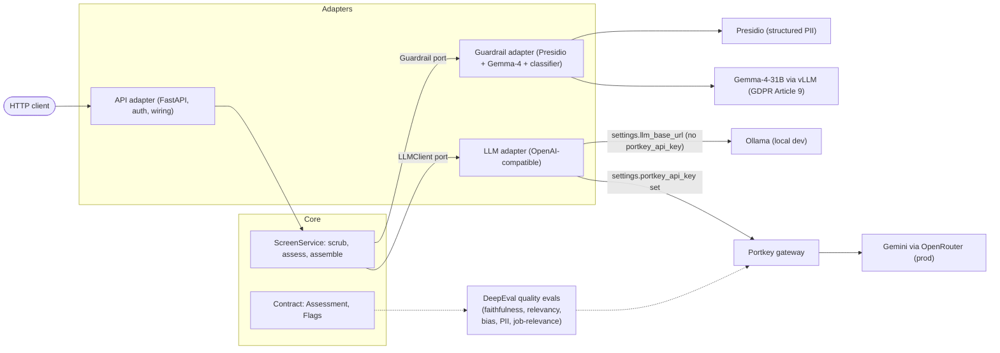

# Screening — hardened `POST /screen`


Turns a candidate interview transcript + job description into **structured decision-support
for a human recruiter**: a fit score (1–5), a rationale citing evidence, and a suggested next
step. 

---

## How to run

```bash
# 1. install (uv manages the venv + lockfile)
uv sync

# 2. configure secrets — nothing sensitive is committed
cp .env.example .env      # then edit .env with your values
#   SCREENING_SERVICE_API_KEY   – the API key clients must send (required; app refuses to boot without it)
#   SCREENING_LLM_BASE_URL      – OpenAI-compatible endpoint (default: local Ollama)
#   SCREENING_LLM_MODEL         – model name (default: qwen2.5:3b)

# 3. run the API
uv run fastapi dev app/api/main.py
#   docs / manual testing: http://127.0.0.1:8000/docs
```

Send requests with the `x-api-key` header:

```bash
curl -X POST http://127.0.0.1:8000/screen \
  -H "x-api-key: $SCREENING_SERVICE_API_KEY" \
  -H "content-type: application/json" \
  -d '{"transcript": "...", "job_description": "..."}'
```

Getting an actual assessment back (a normal request that isn't flagged) needs an LLM running at
`SCREENING_LLM_BASE_URL`. This project was built and
tested against **`qwen2.5:3b`** served locally via [Ollama](https://ollama.com) — a small, free,
OpenAI-compatible model, so no paid API is needed. Because the model sits behind a vendor-agnostic
adapter, swapping it for a larger instruction-tuned model (a 7B+ local model, or a hosted frontier
model via any OpenAI-compatible endpoint) would sharpen rationale quality and cut malformed-output
retries — config only, no code change.

```bash
# one-time: install Ollama from https://ollama.com, then
ollama serve                 # start the server (defaults to http://localhost:11434)
ollama pull qwen2.5:3b       # download the model this project expects
ollama list                  # verify it's present
```

The **injection** (*manipulation* — text that tries to hijack the model's instructions) and **PII**
(*identifiers* — personal data that identifies someone) paths run without a live model.

## Run the evals

```bash
uv run pytest -m "not live and not prod and not quality"   # deterministic — no model, no network. Run these in CI.
uv run pytest -m live                      # hits the real Presidio + Gemma-4 + injection classifier (+ a live LLM)
uv run pytest -m prod --run-prod           # hits the deployed prod endpoint (needs az login; opt-in on purpose)

uv run deepeval test run evals/test_quality.py   # output-quality evals (costs tokens — a live LLM plus a judge LLM)
```

> The quality suite is meant to be launched via `deepeval test run`, not plain `pytest -m quality`:
> `deepeval test run` is a thin wrapper around pytest that adds per-metric reporting and (with
> `CONFIDENT_API_KEY` set) uploads results to Confident AI, neither of which plain `pytest` gives you.
> `evals/test_quality.py` calls `assert_test` directly with no tracing involved, so `pytest -m quality`
> also works — you just lose that reporting. CI deselects the marker (`not quality`) because it hits a
> live LLM plus a judge LLM and costs tokens on every run.

- **Deterministic** tests use fakes behind the ports (canned + deliberately malformed LLM output),
  so they're fast and reproducible. Run in CI.
- **Live** tests exercise the real guardrail over genuine transcripts in
  `evals/fixtures.json` (`T-1`…`T-4`), including an **adversarial** (an embedded
  prompt injection).
- **Prod** tests (`tests/integration/test_prod.py`) hit the actual deployed Container App, parametrized over
  every fixture, asserting both the safety flags (`injection_detected`, `pii_redacted`) and exact
  strings that must never leak into the response. Gated behind `--run-prod` so it can never fire by
  accident — the same discipline `conftest.py` applies via `pytest_addoption`.
- **Quality** tests (`evals/test_quality.py`, marker `quality`) judge `rationale`/`evidence` with
  DeepEval metrics, through the same Portkey gateway the app itself uses. Different question from
  the safety tests above (*is the score honest*, not *did PII leak*). Kept out of CI because it
  costs tokens on every run and its verdict is a judge's opinion, not a deterministic bit.

---

## Evaluation — what we check in the LLM's response

The safety tests (live/prod, above) answer *"did anything leak, did injection get caught."*
None of them answer the harder question: **is the `Assessment` itself any good** — grounded,
on-topic, and fair? That's what `evals/metrics.py` checks, run as **DeepEval** metrics and judged by
a model routed through the same Portkey gateway the app uses in production (`evals/judge.py`) — an
eval that judged through a different provider than production would be measuring a model we do not
ship.

Each metric carries a threshold, so a run is pass/fail per case; with `CONFIDENT_API_KEY` set the
run is also uploaded to Confident AI, where successive runs can be compared.

Every metric judges the same thing — the LLM's `rationale` + `evidence` (the `output`) — but
compares it against something different:

| Metric | Question it answers | Compared against |
|---|---|---|
| **Faithfulness** | Did it invent something? | `transcript` **+** `job_description` — a claim must not contradict either (see below for why both) |
| **Relevancy** | Is every sentence on topic for the role? | `job_description` — this is what defines what "relevant" even means |
| **Bias** | Any unfair opinion in the text? | Nothing external — four fixed categories: gender, political, racial/ethnic, geographical |
| **JobRelevantScoring** (custom classifier) | Did scoring stay off protected characteristics? | `job_description` + our own criteria — disability, age, ethnicity, religion, visa status, trade union membership, health. `ethnicity` deliberately overlaps `Bias`: that scorer asks whether the *tone* is prejudiced, this one whether the characteristic was used to *justify the score* — a neutrally-worded rationale can still fail here |

**Why Faithfulness checks against both transcript and job description, not transcript alone:**
some claims are compound — *"the candidate's six years of Python experience meets the job's
requirement"* blends a transcript fact (six years, Python) with a job-description fact (Python
is required). Checking only the transcript half would let a model misrepresent what the role
actually asks for and never get caught.

**What "on-topic" concretely means for Relevancy:** every individual sentence in the
`rationale`/`evidence` must engage with something the job description actually asks for — a
skill, a requirement, a responsibility — not just be *true* about the candidate. A sentence can
be 100% factually correct and still drag the score down if it's a tangent, caveat, or pleasantry
unrelated to the role. Example, against T-1's job description (Senior Backend Engineer —
Python, Go, AWS, Postgres, reliability):
- **On-topic**: *"The candidate has six years of experience on payments systems using Python
  and Go."*
- **Off-topic, even though true**: *"The candidate mentioned they have a hearing impairment and
  prefer written follow-ups."* — a real transcript fact, but it doesn't engage anything the JD
  asked for. (This is also exactly the kind of sentence `JobRelevantScoring` watches for, from
  a fairness angle rather than a topicality one.)

**Why the `Bias` scorer alone isn't enough for a hiring tool:** its four categories don't
cover the protected characteristics this app's own transcripts actually contain (disability,
age, visa status, union membership, health — the same categories GLiNER exists to redact). The
custom `JobRelevantScoring` classifier exists specifically to close that gap, encoding this app's
own system-prompt rule ("judge only on job-relevant evidence") as a scorable criterion. Its
`ethnicity` category overlaps `Bias` on purpose — the two ask different questions of the same
word (prejudiced *tone* vs. used to *justify the score*).

**How `JobRelevantScoring` is built:** a DeepEval `DAGMetric` — a two-question decision tree rather
than a single prompt. The root asks *does the text reference a protected characteristic at all*; only
if it does do we ask the harder follow-up, *was it used to justify the score, or merely mentioned*.
The leaves score 0 (used to justify), 5 (mentioned only) and 10 (never mentioned); DeepEval divides
by 10, and the metric's threshold of `0.5` is what keeps the follow-up meaningful — mentioning
passes, scoring on it fails. A threshold of `1.0` would collapse both branches into the same failure
and make the second question pointless.

**The quality run goes through `ScreenService`, not the LLM adapter directly.** The model is judged
on guardrail-scrubbed text — exactly what it receives in production. Calling the adapter directly
would feed it the raw fixtures and penalise it for quoting PII that would never have reached it,
turning `JobRelevantScoring` into a pessimistic number that's easy to misread.

**What's deliberately *not* measured yet:** whether `next_step` follows logically from
`fit_score` — a schema-consistency check, not a grounding one. Worth a scorer of its own.

The adversarial fixture is excluded from the quality run, and by its declared expectation
(`expect.injection_detected`) rather than by id: the guardrail withholds an injected transcript and
the model is never called, so there is no assessment text to judge. That the withholding happens at
all is asserted by the live and prod tests instead. The quality test also asserts the *runtime*
scrub came back clean — the fixture list is filtered on a declared expectation, so without that
check a guardrail regression would have the judge silently scoring withheld-result boilerplate.

---

## What's implemented 

| Area | How |
|---|---|
| **Structured, validated output** | `instructor` + Pydantic `Assessment`: `fit_score` constrained `1–5`, `rationale`/`evidence`/`next_step` enforced by the schema. Malformed model output → bounded re-ask (`max_retries=2`), then a mapped `502`. |
| **Guardrail** | Presidio (structured PII: email, phone, DOB, UK NINO, UK postcode) + **GLiNER** (zero-shot, catches GDPR Article 9 special categories — religion, health, disability, sexual orientation, trade union, political opinion, ethnicity) + a trained injection classifier. **Fail-closed**: detected injection withholds the transcript — the model is never called. |
| **Eval harness** | pytest, three-way split: deterministic (fakes, CI) / live (real guardrail + LLM, local) / prod (real deployed endpoint, opt-in via `--run-prod`) — plus a **DeepEval** `quality` tier for output quality, run separately via `deepeval test run` because it costs tokens on every run. |
| **Auth** | `x-api-key` header, `secrets.compare_digest` (constant-time compare: checks the whole key regardless of where it differs, so response timing can't be used to guess the key character by character). |
| **Secrets** | pydantic-settings from env/`.env`; no key default — the app **refuses to start** without one, so a real key can never be silently missing. |
| **Error handling & logging** | Timeout→504, connection→503, bad model output→502; catch-all fails closed. Structured **JSON logs, metadata only** (see [Blind spots](#guardrail-blind-spots-what-it-does-not-catch)). |
| **Cost awareness** | Per-call token usage logged (`llm_usage`); see [Cost awareness](#cost-awareness). |
| **Model routing** | Local dev talks straight to Ollama. Production: app → **Portkey** (gateway — sits in front of the app's LLM calls; observability/logging/retries, one stable endpoint) → **OpenRouter** (provider aggregator — holds API access to many vendors under one key) → Gemini (the model actually generating the response). Swapping providers/models is an env var, not a code change. Same gateway is reused as the DeepEval judge endpoint (`evals/judge.py`); the LLM adapter itself carries no eval instrumentation — the quality tier calls `ScreenService` itself against fixtures and judges the fresh assessment, so no candidate data leaves the service on a live request. |

---

## Tradeoffs & what I prioritised

- **Safety over score quality.** The model is the *least* interesting part, so effort
  went into the boundary: injection fail-closed, PII redaction, validated output, honest failure modes.
- **`fit_score` can be `None`.** On a withheld/injected transcript there is no honest score — so the
  schema represents *absence* rather than emitting a misleading `1` ("poor fit"). Cost: even on a
  normal, valid request the score is no longer guaranteed by the schema (see [Next steps](#next-steps)).
- **Deterministic evals via fakes.** The LLM is faked in the fast suite;
  live tests cover the real guardrail where the behaviour actually matters.

## Cost awareness

- **Where it blows up:** cost scales with **input tokens**, and the transcript is the input. Long
  transcripts, the re-ask retries (`max_retries`), and the system prompt on every call all add up.
- **What's in place:** every call logs `prompt/completion/total_tokens`, so cost is *observable* per request.
- **One thing I'd do next:** cap transcript length before the call — the transcript is the one unbounded
  input, so a token ceiling bounds worst-case cost, latency, and context use. (Detail and the chunking
  escalation are in [Next steps](#next-steps).)

## Guardrail blind spots (what it does *not* catch)

- **Injection detection is a best guess, not a rule.** It's an ML model that estimates how likely a piece
  of text is an attack and flags anything past a set cutoff — so it can be wrong both ways: it can **miss**
  a cleverly disguised attack, and it can **false-alarm** on innocent text that happens to sound like an
  instruction ("please ignore the typo above"). → [what I'd try](#next-injection-threshold)
- **A small attack can hide in a lot of normal text.** If the injection is a sentence buried in a long,
  ordinary transcript, its "attack" signal gets watered down by everything around it and can slip under
  the flag cutoff. Checking the text in smaller pieces helps, but an attacker who pads with enough
  innocent text can still get through. → [what I'd try](#next-dilution-window)
- **Free-text PII is English-only.** Names and locations rely on the spaCy `en` model, so a non-English
  transcript under-redacts them; structured identifiers (email, multi-region phone, UK NI/postcode) are
  regex-based and still catch. → [what I'd try](#next-multilingual-pii)
- **The tech-term allow-list is manual.** New skills mislabelled as names (over-redaction) need adding by hand. → [what I'd try](#next-skills-taxonomy)
- **Injection short-circuits before PII.** A flagged transcript is withheld wholesale and *not* PII-scanned — deliberate (withheld content isn't scored), but worth stating. → [what I'd try](#next-withheld-pii-scan)
- **Overlapping entity spans can merge into the wrong label.** Observed in a real Portkey trace: an
  address+postcode span got merged with an adjacent already-anonymized `<EMAIL_ADDRESS>` placeholder
  and inherited that label instead of `<LOCATION>`/`<UK_POSTCODE>`. Still fully redacted (nothing
  leaked), but the mislabeling suggests the anonymizer's overlap-resolution isn't robust to every
  span combination — worth a closer look before trusting entity *type* in logs, not just redaction
  itself.

## Next steps

- **No datastore / UI / IaC** — out of scope per the brief. (CI/CD now exists — see `DEPLOY.md` —
  gated by branch protection requiring the `checks` job to pass, including for admins.)
- **`out_of_scope` flag not fully wired** for genuinely thin transcripts (only set on injection today).
- **No rate limiting / request quotas** on the endpoint.
- **Always return a score on normal requests:** split into a required-score `Assessment` (LLM output) + an
  optional-score result wrapper, so `None` is only possible on withheld (flagged) cases.
- **Cap transcript length, then chunk if it outgrows the window.** Cost and latency scale with input
  tokens and the transcript is unbounded user input, so first a token ceiling (keeping head+tail if
  exceeded) bounds worst-case spend and keeps us inside the context window. If transcripts routinely
  outgrew the window, I'd escalate to chunk-and-map-reduce (chunk on question boundaries, each chunk
  extracts evidence, one final call scores over it) rather than truncating — and settle which split/merge
  strategy wins empirically, through the eval harness, not by guessing.

### Guardrail hardening (mitigations for the blind spots above)

- <a id="next-injection-threshold"></a>**Tune the injection threshold on a labeled set,** biased toward
  **recall** — a missed attack is costly, a false alarm just routes to the human reviewer. Optionally
  ensemble a cheap regex pass with the classifier.
- <a id="next-dilution-window"></a>**Scan in overlapping windows and take the *max* score, not the average,**
  so a concentrated attack isn't diluted by surrounding text. Cheapest, highest-value fix here.
- <a id="next-multilingual-pii"></a>**Add multilingual PII detection** — a multilingual NER model (or a
  learned PII model like piiranha), or detect the language and route to the right model.
- <a id="next-skills-taxonomy"></a>**Stop hand-maintaining the skills list.** Today a small hand-typed
  list tells the redactor which tech terms to leave alone (so "Go" or "Java" aren't mistaken for a
  person's name and removed). Every new skill has to be added manually. Instead, check words against a
  ready-made, professionally-maintained catalogue of job skills (e.g. **ESCO** or **O\*NET**), so new
  skills are already recognised and nothing needs adding by hand.
- <a id="next-withheld-pii-scan"></a>**PII-scan withheld content before logging,** so nothing sensitive leaks into logs even when the transcript is withheld from scoring.
- **Consider Azure AI Language's managed PII detection.** Self-hosted Presidio hit several real edge
  cases along the way (a NINO regex that missed HMRC's own specimen number, a UK postcode format
  Presidio doesn't catch by default, the entity-mislabeling above) — a managed service removes that
  whole class of bug and adds multilingual support for free, closing the blind spot above too. Given
  this project is already Azure-first (Container Apps, Key Vault, OIDC), it's a natural fit; not done
  yet because each self-hosted fix was cheap in isolation and the migration itself is real work
  (new adapter, new tests, redeploy).
- **Benchmark alternative injection-detection models.** The current classifier
  (`protectai/deberta-v3-base-prompt-injection-v2`) was picked without comparing it to alternatives —
  worth a proper bake-off on a labeled set before trusting it long-term, same rigor as the guardrail
  work above.

---

# Architecture — hexagonal (ports & adapters)

The **core** (domain + ports) is vendor-free: it defines *what* must happen
(`scrub → assess → assemble`) plus two interfaces — a `Guardrail` that scrubs and an
`LLMClient` that assesses. **Adapters** on the outside implement those interfaces against
real tools (Presidio, an OpenAI-compatible model), and the composition root
(`api/main.py`) wires them in. Dependencies point **inward**: adapters know the core, the
core knows nothing about them.



Solid arrows are the live request path; dotted arrows are evaluation-only — meaning *outside the
production request path*, not model-free or network-free. The quality tier runs against fixtures on
demand and does call a live model twice per case (the app's own LLM, then the judge), through the
same gateway.

**Pros**

- **Swap vendors without touching business logic** — A new LLM or guardrail is one new adapter plus one line in the composition root.
- **The core is testable with fakes** — deterministic evals run with no model and no network,
  because `ScreenService` depends only on the ports.
- **Safety ordering lives in one vendor-free place** — the scrub-before-assess rule is explicit
  and hard to break by accident.

**Cons**

- **More indirection than a flat script** — ports + adapters are boilerplate a single endpoint
  doesn't strictly need; justified here only because swappability and testability *are* the point.
- **Complexity concentrates in the composition root** — `api/main.py` is the one place that knows
  everything, so it carries the wiring weight.
- **The call path is less obvious** — a request hops core → port → adapter, more to trace than a
  straight-line script.

---

# Deployment topology — why the detector is a second container

The Article 9 detector is Gemma-4-31B, which needs ~62 GB of VRAM at bf16. That does not
fit on a CPU container and does not fit on a T4 (16 GB), so it cannot live in the same
container as the API — it needs its own A100. Splitting it out is a hardware constraint
first, and only incidentally a design choice.

What makes the split safe is *where* the second container sits. It receives the transcript
**before** redaction, so it sees raw PII and Article 9 special-category data. It therefore
runs on **internal ingress**: no public DNS name, no route in from the internet, reachable
only by apps inside the same managed environment. That is also why both containers must
share one environment, and therefore one region — an environment is single-region, so
co-location is what buys the private hop.

```
                    ┌─────────────────────────────────────────────────────────┐
   client           │  managed environment  (Sweden Central)                  │
     │              │                                                         │
     │  raw         │   ┌───────────────────────────────┐                     │
     │  transcript  │   │  CONTAINER 1   screening-app  │                     │
     └──── HTTPS ───┼──►│  CPU · Consumption · min=0    │                     │
       (public      │   │                               │                     │
                    │   │  ClassifierGuardrail          │                     │
                    │   │    ├ injection classifier     │                     │
                    │   │    └ AnalyzerEngine           │                     │
                    │   │             .analyze(text) ───┼──── ONE PASS ────┐  │
                    │   │             ├ regex: NINO     │                  │  │
                    │   │             ├ regex: POSTCODE │                  │  │
                    │   │             ├ spaCy NER       │                  │  │
                    │   │             └ LLMGuardrail    │                  │  │
                    │   │                Recognizer ────┼──┐               │  │
                    │   │                               │  │ raw text      │  │
                    │   │  ◄── spans merged ────────────┼──┘ over INTERNAL │  │
                    │   │      anonymize → <RELIGION>   │    ingress only  │  │
                    │   │                               │  ▼               │  │
                    │   └───────────────┬───────────────┘  │               │  │
                    │                   │        ┌─────────┴────────────┐  │  │
                    │                   │        │ CONTAINER 2          │  │  │
                    │                   │        │ screening-gemma      │◄─┘  │
                    │                   │        │ A100 80GB · min=0    │     │
                    │                   │        │ vLLM + Gemma-4-31B   │     │
                    │                   │        │ NO public address    │     │
                    │                   │        └──────────────────────┘     │
                    └───────────────────┼─────────────────────────────────────┘
                                        │  redacted transcript only
                                        ▼
                                   Portkey ──► Gemini   (assessment)

```

The detail worth noticing is that Presidio and Gemma are **not** two sequential stages.
`AnalyzerEngine.analyze()` runs every registered recognizer over the same text in a single
call, and `LLMGuardrailRecognizer` is simply one of them that happens to make an HTTP hop.
All spans — regex, spaCy, and LLM — are merged before a single anonymization step. Adding
the LLM detector was a registry call, not a pipeline rewrite.

Both containers scale to zero. Serverless GPU bills only while a replica is running and
idle charges do not apply, so the cost of the A100 when nobody is screening is nothing; the
trade is a multi-minute cold start while ~62 GB of weights load from the mounted share.

Infrastructure for container 2 lives in `infra/gemma/`.
