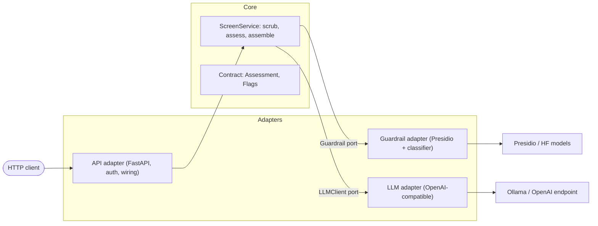

# Screening — hardened `POST /screen`


Turns a candidate interview transcript + job description into **structured decision-support
for a human recruiter**: a fit score (1–5), a rationale citing evidence, and a suggested next
step. 

---

## How to run

```bash
# 1. install (uv manages the venv + lockfile)
uv sync

# 2. configure secrets — nothing sensitive is committed
cp .env.example .env      # then edit .env with your values
#   SCREENING_SERVICE_API_KEY   – the API key clients must send (required; app refuses to boot without it)
#   SCREENING_LLM_BASE_URL      – OpenAI-compatible endpoint (default: local Ollama)
#   SCREENING_LLM_MODEL         – model name (default: qwen2.5:3b)

# 3. run the API
uv run fastapi dev app/api/main.py
#   docs / manual testing: http://127.0.0.1:8000/docs
```

Send requests with the `x-api-key` header:

```bash
curl -X POST http://127.0.0.1:8000/screen \
  -H "x-api-key: $SCREENING_SERVICE_API_KEY" \
  -H "content-type: application/json" \
  -d '{"transcript": "...", "job_description": "..."}'
```

Getting an actual assessment back (a normal request that isn't flagged) needs an LLM running at
`SCREENING_LLM_BASE_URL`. This project was built and
tested against **`qwen2.5:3b`** served locally via [Ollama](https://ollama.com) — a small, free,
OpenAI-compatible model, so no paid API is needed. Because the model sits behind a vendor-agnostic
adapter, swapping it for a larger instruction-tuned model (a 7B+ local model, or a hosted frontier
model via any OpenAI-compatible endpoint) would sharpen rationale quality and cut malformed-output
retries — config only, no code change.

```bash
# one-time: install Ollama from https://ollama.com, then
ollama serve                 # start the server (defaults to http://localhost:11434)
ollama pull qwen2.5:3b       # download the model this project expects
ollama list                  # verify it's present
```

The **injection** (*manipulation* — text that tries to hijack the model's instructions) and **PII**
(*identifiers* — personal data that identifies someone) paths run without a live model.

## Run the evals

```bash
uv run pytest -m "not live"   # deterministic — no model, no network. Run these in CI.
uv run pytest -m live         # hits the real Presidio + injection classifier (+ a live LLM for the LLM test)
```

- **Deterministic** tests use fakes behind the ports (canned + deliberately malformed LLM output),
  so they're fast and reproducible.
- **Live** tests exercise the real guardrail over genuine transcripts in
  `evals/fixtures.json` (`T-1`…`T-4`), including an **adversarial** (an embedded
  prompt injection).

---

## What's implemented 

| Area | How |
|---|---|
| **Structured, validated output** | `instructor` + Pydantic `Assessment`: `fit_score` constrained `1–5`, `rationale`/`evidence`/`next_step` enforced by the schema. Malformed model output → bounded re-ask (`max_retries=2`), then a mapped `502`. |
| **Guardrail** | Presidio (PII redaction) + a trained injection classifier. **Fail-closed**: detected injection withholds the transcript — the model is never called. |
| **Eval harness** | pytest, deterministic/live split. |
| **Auth** | `x-api-key` header, `secrets.compare_digest` (constant-time compare: checks the whole key regardless of where it differs, so response timing can't be used to guess the key character by character). |
| **Secrets** | pydantic-settings from env/`.env`; no key default — the app **refuses to start** without one, so a real key can never be silently missing. |
| **Error handling & logging** | Timeout→504, connection→503, bad model output→502; catch-all fails closed. Structured **JSON logs, metadata only** (see [Blind spots](#guardrail-blind-spots-what-it-does-not-catch)). |
| **Cost awareness** | Per-call token usage logged (`llm_usage`); see [Cost awareness](#cost-awareness). |

---

## Tradeoffs & what I prioritised

- **Safety over score quality.** The model is the *least* interesting part, so effort
  went into the boundary: injection fail-closed, PII redaction, validated output, honest failure modes.
- **`fit_score` can be `None`.** On a withheld/injected transcript there is no honest score — so the
  schema represents *absence* rather than emitting a misleading `1` ("poor fit"). Cost: even on a
  normal, valid request the score is no longer guaranteed by the schema (see [Next steps](#next-steps)).
- **Deterministic evals via fakes.** The LLM is faked in the fast suite;
  live tests cover the real guardrail where the behaviour actually matters.

## Cost awareness

- **Where it blows up:** cost scales with **input tokens**, and the transcript is the input. Long
  transcripts, the re-ask retries (`max_retries`), and the system prompt on every call all add up.
- **What's in place:** every call logs `prompt/completion/total_tokens`, so cost is *observable* per request.
- **One thing I'd do next:** cap transcript length before the call — the transcript is the one unbounded
  input, so a token ceiling bounds worst-case cost, latency, and context use. (Detail and the chunking
  escalation are in [Next steps](#next-steps).)

## Guardrail blind spots (what it does *not* catch)

- **Injection detection is a best guess, not a rule.** It's an ML model that estimates how likely a piece
  of text is an attack and flags anything past a set cutoff — so it can be wrong both ways: it can **miss**
  a cleverly disguised attack, and it can **false-alarm** on innocent text that happens to sound like an
  instruction ("please ignore the typo above"). → [what I'd try](#next-injection-threshold)
- **A small attack can hide in a lot of normal text.** If the injection is a sentence buried in a long,
  ordinary transcript, its "attack" signal gets watered down by everything around it and can slip under
  the flag cutoff. Checking the text in smaller pieces helps, but an attacker who pads with enough
  innocent text can still get through. → [what I'd try](#next-dilution-window)
- **Free-text PII is English-only.** Names and locations rely on the spaCy `en` model, so a non-English
  transcript under-redacts them; structured identifiers (email, multi-region phone, UK NI/postcode) are
  regex-based and still catch. → [what I'd try](#next-multilingual-pii)
- **The tech-term allow-list is manual.** New skills mislabelled as names (over-redaction) need adding by hand. → [what I'd try](#next-skills-taxonomy)
- **Injection short-circuits before PII.** A flagged transcript is withheld wholesale and *not* PII-scanned — deliberate (withheld content isn't scored), but worth stating. → [what I'd try](#next-withheld-pii-scan)

## Next steps

- **No datastore / UI / CI / IaC** — out of scope per the brief.
- **`out_of_scope` flag not fully wired** for genuinely thin transcripts (only set on injection today).
- **No rate limiting / request quotas** on the endpoint.
- **Always return a score on normal requests:** split into a required-score `Assessment` (LLM output) + an
  optional-score result wrapper, so `None` is only possible on withheld (flagged) cases.
- **Cap transcript length, then chunk if it outgrows the window.** Cost and latency scale with input
  tokens and the transcript is unbounded user input, so first a token ceiling (keeping head+tail if
  exceeded) bounds worst-case spend and keeps us inside the context window. If transcripts routinely
  outgrew the window, I'd escalate to chunk-and-map-reduce (chunk on question boundaries, each chunk
  extracts evidence, one final call scores over it) rather than truncating — and settle which split/merge
  strategy wins empirically, through the eval harness, not by guessing.

### Guardrail hardening (mitigations for the blind spots above)

- <a id="next-injection-threshold"></a>**Tune the injection threshold on a labeled set,** biased toward
  **recall** — a missed attack is costly, a false alarm just routes to the human reviewer. Optionally
  ensemble a cheap regex pass with the classifier.
- <a id="next-dilution-window"></a>**Scan in overlapping windows and take the *max* score, not the average,**
  so a concentrated attack isn't diluted by surrounding text. Cheapest, highest-value fix here.
- <a id="next-multilingual-pii"></a>**Add multilingual PII detection** — a multilingual NER model (or a
  learned PII model like piiranha), or detect the language and route to the right model.
- <a id="next-skills-taxonomy"></a>**Stop hand-maintaining the skills list.** Today a small hand-typed
  list tells the redactor which tech terms to leave alone (so "Go" or "Java" aren't mistaken for a
  person's name and removed). Every new skill has to be added manually. Instead, check words against a
  ready-made, professionally-maintained catalogue of job skills (e.g. **ESCO** or **O\*NET**), so new
  skills are already recognised and nothing needs adding by hand.
- <a id="next-withheld-pii-scan"></a>**PII-scan withheld content before logging,** so nothing sensitive leaks into logs even when the transcript is withheld from scoring.

---

# Architecture — hexagonal (ports & adapters)

The **core** (domain + ports) is vendor-free: it defines *what* must happen
(`scrub → assess → assemble`) plus two interfaces — a `Guardrail` that scrubs and an
`LLMClient` that assesses. **Adapters** on the outside implement those interfaces against
real tools (Presidio, an OpenAI-compatible model), and the composition root
(`api/main.py`) wires them in. Dependencies point **inward**: adapters know the core, the
core knows nothing about them.



**Pros**

- **Swap vendors without touching business logic** — A new LLM or guardrail is one new adapter plus one line in the composition root.
- **The core is testable with fakes** — deterministic evals run with no model and no network,
  because `ScreenService` depends only on the ports.
- **Safety ordering lives in one vendor-free place** — the scrub-before-assess rule is explicit
  and hard to break by accident.

**Cons**

- **More indirection than a flat script** — ports + adapters are boilerplate a single endpoint
  doesn't strictly need; justified here only because swappability and testability *are* the point.
- **Complexity concentrates in the composition root** — `api/main.py` is the one place that knows
  everything, so it carries the wiring weight.
- **The call path is less obvious** — a request hops core → port → adapter, more to trace than a
  straight-line script.
